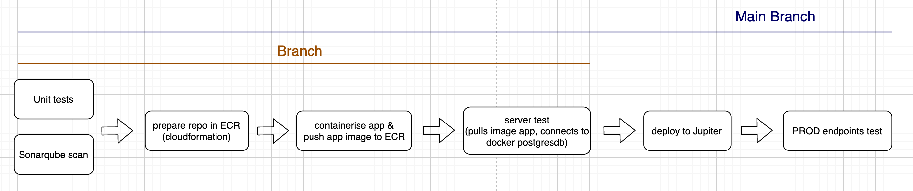

# Frameworkless Web Application Kata

[](https://buildkite.com/myob/tiffany-frameworkless-web-app-api)

A .NET Core solution to [the Frameworkless Basic Web Application kata](https://github.com/MYOB-Technology/General_Developer/blob/main/katas/kata-frameworkless-basic-web-application/kata-frameworkless-basic-web-application.md) with [enhancements](https://github.com/MYOB-Technology/General_Developer/blob/main/katas/kata-frameworkless-basic-web-application/kata-frameworkless-basic-web-application-enhancements.md).

* * *

# How to use the app

## Access

-   The aplication is accessible under MYOB VPN. 
-   Please make sure request with Authorization header:  
    `Authorization: Basic <credentials>`  
-   In order to get the `<credentials>`, you have to have permission to log in to either: 
    -   europa-preprod in kubenetes then in cli run  `kubectl get secret/tiffany-app-secret -n fma --template={{.data.value}}` or 
    -   account adfs-fma-dev-admin in aws then in cli run `aws ssm get-parameter --name "tiffany-app-secret" --query Parameter.Value --with-decryption --output text --region ap-southeast-2` or  
    -   please contact tiffany.hoang@myob.com to get the `<credentials>`

## APIs
Endpoint: `https://tiffany-app.svc.platform.myobdev.com`
1.  `GET /` - greeting with all names & the current date/time of the server. [Example](#get-)
2.  `GET /people` - gets all names in Json format. [Example](#get-people)
3.  `POST /people` - add new name. [Example](#post-people)
4.  `PUT /people/{existing-name}` - update existing name. [Example](#put-peopleexisting-name)
5.  `DELETE /people/{existing-name}` - delete existing name. [Example](#delete-peopleexisting-name)

 **Default name** is **Tiffany** which is not allowed to be updated or deleted.

## Examples:

### GET /
```
curl --request GET \
  --url https://tiffany-app.svc.platform.myobdev.com \
  --header 'Authorization: Basic <credentials>' 
```
```
Hello Tiffany - the time on the server is 10:05 on 06 Apr 2021
```
### GET /people
```
curl --request GET \
  --url https://tiffany-app.svc.platform.myobdev.com/people \
  --header 'Authorization: Basic <credentials>' 
```
```
[  
  {  
    "Name": "Tiffany"  
  }  
]  
```
### POST /people
```
curl --request POST \
  --url https://tiffany-app.svc.platform.myobdev.com/people \
  --header 'authorization: Basic <credentials>' \
  --data '{"Name":"DS"}' 
```
```
{   
  "Name": "DS"  
}  
```
### PUT /people/{existing-name}
```
curl --request PUT \
  --url https://tiffany-app.svc.platform.myobdev.com/people/DS \
  --header 'authorization: Basic <credentials>' \
  --data '{"Name":"DSTeoh"}'
``` 
``` 
{   
  "Name": "DSTeoh"  
}
```
### DELETE /people/{existing-name}
```
curl --request DELETE \
  --url https://tiffany-app.svc.platform.myobdev.com/people/DSTeoh \
  --header 'authorization: Basic <credentials>' 
```
* * *

# Docs

## Development & Test

-   Clone the repo:     
    `git clone git@github.com:myob-fma/tiffany-kata-frameworkless-basic-web-application-api.git`

-   Checkout to folder:     
    `cd tiffany-kata-frameworkless-basic-web-application-api`

### Run app locally

-   Build database image with people table & default name Tiffany  
    `docker-compose -f ./ops/docker/docker-compose-server-test.yaml build database`
-   Spin up the database  
    `docker run --rm --name postgres-db -e POSTGRES_DB=postgres -e POSTGRES_PASSWORD=docker -p 5432:5432 -d postgres-db`
-   Run app  
    `SECRET=secret DB_HOST=localhost DB_PORT=5432 DB_NAME=postgres DB_USER=postgres DB_PASSWORD=docker dotnet run --project WebApplication`

### View database locally

  `pgweb --host localhost --user postgres --db postgres --pass docker`

### Clean up database locally

  `docker stop postgres-db`

### Test

-   Unit tests  
    `./ops/bin/unit-tests.sh`

-   Server test is testing the application container connects with database container and functions correctly:
    -   build app image    
        `docker build -f ./ops/docker/Dockerfile -t app .` 
    -   run server test     
        `appImage=app docker-compose -f ./ops/docker/docker-compose-server-test.yaml up --abort-on-container-exit`
    -   remove all containers after testing     
        `docker-compose -f ./ops/docker/docker-compose-server-test.yaml down`

## API Design


## Pipeline diagram



* * *

#### *AWS*
*[aws-deployment](https://github.com/myob-fma/tiffany-kata-frameworkless-basic-web-application-api/tree/aws-deployment) branch*

-   *AWS infrastructure with cloudformation*
-   *contains the very first version api design with in memory data*
-   *the pipeline is not up to date*